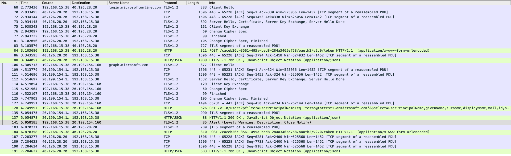

# TCP Dump Analyses with Wireshark

This repo aims to store all notes from TCP Dump analyses using Wireshark tool. The repo contains tips, tricks, teory overview and good practices.


## References

[Wireshark Ultime Hands On](https://www.udemy.com/course/wireshark-ultimate-hands-on-course/)

[Wireshark Docs](https://www.wireshark.org/docs)

## Requirements

Wireshark

[GeoLite2 Free Geolocation Data](https://dev.maxmind.com/geoip/geolite2-free-geolocation-data?lang=en)


## Commands
```bash
tcpdump -i eth0 -s 65535 -w /tmp/tcp_dump.pcap
```
```bash
tshark -i eth0 -Y "ip.src==10.224.106.73 and http"
```


## Interface


### Filters

```bash
eq not or and
==  !   |  &&
```

```bash
contains (exact string) # frame contains google
match (regex) # http.host matches "\.(org|com|br)"
```

#### Statistics


### Tips & Tricks

#### TCP Options to take a look

* TTL (Time to Live) - Router passed throw;
* Window Size
* Delta Time (Time between last packages sent/received)
* TCP Options

  * Acknowledment
  * Push
  * Reset
  * Syn

### Multi Remote Hosts TCP Dump + WireShark Analysis
```bash
mkfifo /tmp/pcap
wireshark -k -i /tmp/pcap

ssh user@host1 "tcpdump -s 0 -U -n  -w -" > /tmp/pcap
ssh user@host2 "tcpdump -s 0 -U -n  -w -" > /tmp/pcap
```

### TLS Decrypted

To read TLS messages we need to have the Keys changed between client and server. 

To do that we have two ways:

##### Linux + Mac

Add SSLKEYLOGFILE variable to environment

```bash
echo 'export SSLKEYLOGFILE=/tmp/sslkeylogfile.log' >> ~/.bash_profile
```

#### Java Apps

Add Java Agent to application running to store all SSL keys in file

https://github.com/neykov/extract-tls-secrets

```bash
java -jar ~/Downloads/extract-tls-secrets-4.0.0.jar list
java -jar ~/Downloads/extract-tls-secrets-4.0.0.jar <pid> /tmp/secrets.log
```


##### Upload TLS secrets on wireshark in:

Preferences > Protocols > TLS > (Pre)-Master-Secret Log Filename 


##### Results



